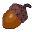

<p align="center">
  
</p>

<h1 align="center">Scrat</h1>

<p align="center">A privacy-first, local-only personal finance desktop app.</p>

<p align="center">
  <a href="https://github.com/tanguy-a-dev/scrat/actions/workflows/ci.yml"></a>
  <a href="./LICENSE.md"></a>
  
  
  
  
</p>

> **A note on how this was built:** this codebase was written with [Claude
> Code](https://claude.com/claude-code) as a pair-programming/coding agent.
> Architecture, invariants, and review were human-directed, but a large share
> of the implementation, tests, and docs were
> generated by Claude. See [LICENSE.md](./LICENSE.md) for reuse terms.

## What is Scrat?

Scrat is a desktop app for tracking personal finances — accounts,
transactions, categories, and spending over time — without sending a single
byte of your financial data anywhere. There is no server, no account, no
telemetry, and no analytics. Everything lives in one SQLCipher-encrypted
SQLite file on your own disk.

The name is a nod to the acorn-obsessed squirrel from *Ice Age* — Scrat
squirrels away your data locally, the way he squirrels away his acorn.

## Features

- **Accounts** — track balances across multiple accounts, each anchored by
  an opening balance you provide once.
- **Transactions** — a searchable, filterable ledger (by amount, type,
  account) with income/expense/transfer/adjustment semantics.
- **Categories** — a two-level category/subcategory hierarchy for organizing
  spending.
- **CSV import** — import bank exports with automatic column detection
  (date, amount, description) that tolerates messy real-world exports
  (ragged rows, decimal-comma amounts, shifting columns), plus automatic
  category suggestions based on your past categorization of similar
  transactions.
- **Details / reporting** — a hand-rolled spending breakdown (no charting
  dependency) by category over a selected period.
- **Local encryption** — your data is stored in a SQLCipher-encrypted
  database, keyed by a passphrase that is never written to disk.

## Tech stack

Scrat follows a hexagonal / DDD architecture with a strict dependency
direction: pure Rust `domain` → `application` use-cases → infrastructure
adapters (`infra-sqlite`, `infra-csv`) → the Tauri composition root → the
SvelteKit frontend.

| Layer | Technology |
| --- | --- |
| Domain & application logic | Rust (pure, no I/O in `domain`) |
| Persistence | SQLite via [SQLCipher](https://www.zetetic.net/sqlcipher/) (`rusqlite`) |
| Desktop shell | [Tauri 2](https://tauri.app/) |
| UI | [SvelteKit](https://kit.svelte.dev/) + Svelte 5 runes |

## Getting started

### Prerequisites

- [Rust](https://www.rust-lang.org/tools/install) (stable toolchain)
- [Node.js](https://nodejs.org/) 20+
- Platform build dependencies for Tauri — see the [Tauri prerequisites
  guide](https://v2.tauri.app/start/prerequisites/)

### Install & run

```bash
make install
make dev
```

This installs both root (Tauri CLI) and frontend npm dependencies, then
launches the desktop app in development mode with hot reload.

### Other useful commands

```bash
make check           # fmt-check + lint + test, same as CI
make build           # build the desktop app for release
make coverage        # generate a Rust test coverage report
make release-preview # show the version bump the next release would use
make kill            # stop any running dev/app processes
make reset-db        # permanently delete the local database (careful!)
```

Run `make help` to see the full list of targets.

## Releases

Releases are cut automatically. Push to `main`, and once CI is green the
release workflow reads the commit messages written since the last tag, decides
the next [semantic version](https://semver.org/), builds installers for macOS,
Linux, and Windows, and publishes them as a GitHub release whose notes are
those commits.

The version bump follows the commit type:

| Commit type | Bump |
| --- | --- |
| `feat:` | minor — `0.1.4` → `0.2.0` |
| `fix:`, `ux:`, `perf:`, `revert:` | patch — `0.1.4` → `0.1.5` |
| `docs:`, `tests:`, `ops:`, `chore:`, `style:`, `clean:`, `refacto:` | none — no release |
| `feat!:` or a `BREAKING CHANGE:` footer | major, but see below |

Below `1.0.0` a breaking change takes the *minor* slot rather than the major
one — `0.x` is the range where anything may still change, and reaching `1.0.0`
should be a deliberate statement about stability, not something a commit
message does by accident.

If nothing releasable landed — a batch of `docs:` and `chore:` commits, say —
no tag and no release are created. Run `make release-preview` to see what the
next push would produce before you make it.

The version lives in exactly one place, `[workspace.package] version` in the
root `Cargo.toml`. Every other manifest either inherits it
(`src-tauri/Cargo.toml`) or is rewritten from it by `scripts/set-version.sh`.
`src-tauri/tauri.conf.json` deliberately has no `version` key so that Tauri
falls back to the Cargo one; don't add it back, or the two will drift.

To release something the commit types wouldn't (or to force a specific bump),
run the **Release** workflow manually from the Actions tab and pick the bump.

### Released binaries are unsigned

The published installers are not code-signed, because signing certificates are
per-developer and cost money. macOS refuses the first launch of an unsigned
app — right-click it and choose *Open* to get the "open anyway" prompt. Windows
SmartScreen warns for the same reason. Building from source avoids both.

## Privacy

Privacy is the non-negotiable design constraint of this project:

- No network calls, no telemetry, no analytics.
- All data lives in a single local, encrypted SQLite file.
- Your database passphrase is never persisted anywhere; it only exists in
  memory for the lifetime of the running app.

## Contributing

Issues and pull requests are welcome. This project follows
[Conventional Commits](https://www.conventionalcommits.org/) and expects
`cargo fmt`, `cargo clippy -D warnings`, `cargo test --workspace`,
`npm run check`, and `npm run build` to pass before a change is considered
done — `make check` covers the Rust side.

## License

Scrat is open source under a non-commercial license: you're free to use,
modify, and fork it, but not for commercial purposes, and any use must credit
this project. See [LICENSE.md](./LICENSE.md) for the full terms.
